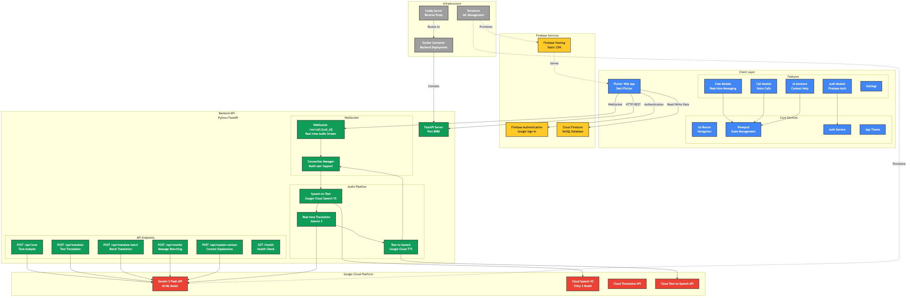
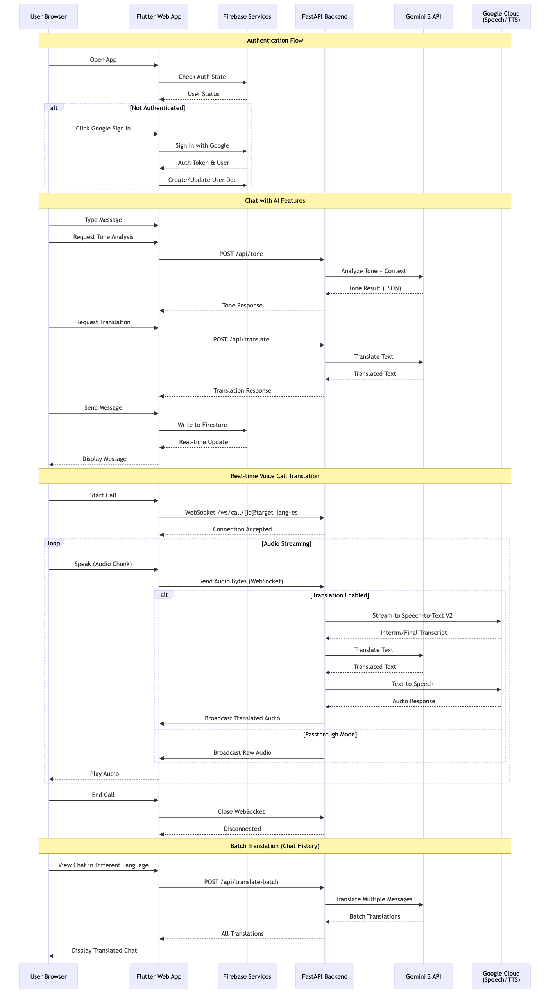
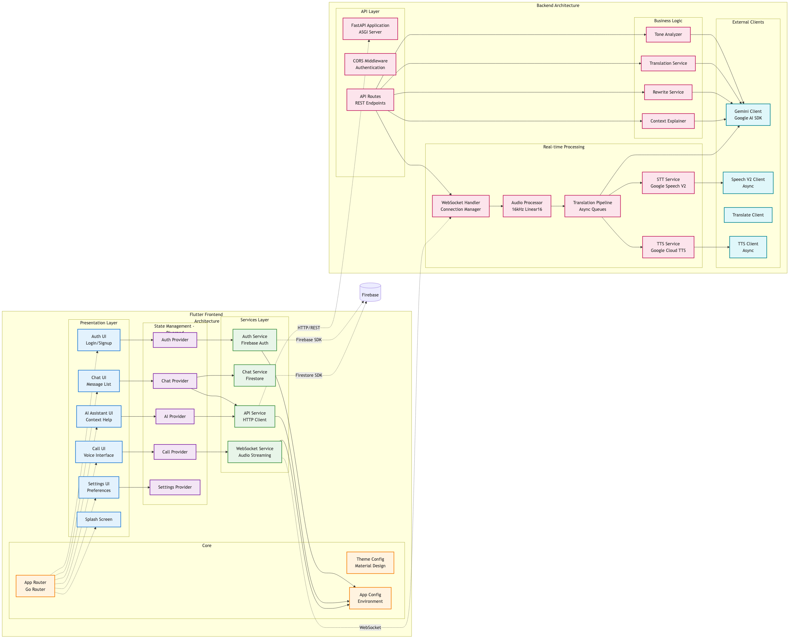
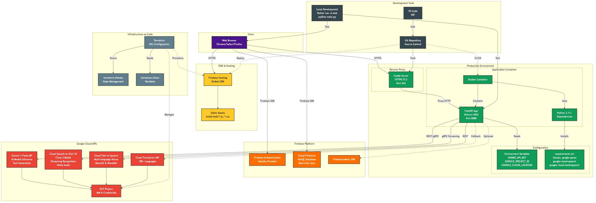

# Vayu 🌬️

**Bridge global teams with AI-powered communication**

Vayu uses Gemini 3 to eliminate language barriers and enhance cross-cultural communication. It provides real-time voice call translation, intelligent tone analysis, and deep context reasoning to ensure every message—spoken or written—is understood exactly as intended.



## ✨ Key Features

### 🎙️ Real-time Voice Translation
*   Live audio streaming with WebSocket support
*   Speech-to-Text using Google Cloud Speech V2 (Chirp 3 model)
*   Instant translation powered by Gemini 3 Flash
*   Natural voice synthesis with Google Cloud Text-to-Speech
*   Support for 10+ languages including English, Spanish, French, German, Hindi, Chinese, Japanese, Korean, Russian, and Portuguese

### 💬 AI-Enhanced Messaging
*   **Tone Analysis**: Understand the emotional context behind messages before sending
*   **Smart Translation**: Translate messages while preserving tone and intent
*   **Message Rewriting**: AI-powered suggestions for clearer, more professional communication
*   **Context Explanation**: Get AI assistance to understand complex conversation threads
*   **Batch Translation**: View entire chat histories in your preferred language

### 🔐 Secure & Real-time
*   Google Sign-In with Firebase Authentication
*   Real-time messaging via Cloud Firestore
*   Unique 6-digit Share IDs for easy user discovery
*   End-to-end encrypted conversations

### 🌐 Cross-Platform
*   Progressive Web App (PWA)
*   Native Android and iOS support
*   Responsive Material Design UI

## 📊 Architecture

Vayu follows a modern client-server architecture with Flutter for the frontend and FastAPI for the backend, integrated with Firebase and Google Cloud Platform services.

### System Overview


### Data Flow


### Component Architecture


### Deployment Infrastructure


For detailed architecture documentation, see [docs/README.md](docs/README.md).

## 🚀 Getting Started

### Prerequisites

#### Frontend
*   [Flutter SDK](https://flutter.dev/docs/get-started/install) (3.0+)
*   [Git](https://git-scm.com/)
*   **For iOS**: [Xcode](https://developer.apple.com/xcode/) (Mac only)
*   **For Android**: [Android Studio](https://developer.android.com/studio)

#### Backend
*   [Python 3.11+](https://www.python.org/downloads/)
*   [Docker](https://www.docker.com/) (optional, for containerized deployment)
*   [Caddy Server](https://caddyserver.com/) (optional, for reverse proxy)

#### Services
*   Firebase Project with Authentication and Firestore enabled
*   Google Cloud Project with APIs enabled:
    *   Gemini API (AI Platform)
    *   Cloud Speech-to-Text API V2
    *   Cloud Text-to-Speech API
    *   Cloud Translation API
*   Environment configuration files (obtain from project owner)

### Installation

#### 1. Clone the Repository
```bash
git clone <repository-url>
cd smart-chat-app
```

#### 2. Frontend Setup (Flutter)

**Install Dependencies:**
```bash
flutter pub get
```

**Configure Environment:**
Create a `.env` file in the root directory:
```env
BACKEND_URL=http://localhost:8080
```

**Configure Firebase:**
> **IMPORTANT:** This project connects to a private Firebase backend. Obtain configuration files from the project owner.

*   **Web**: Place `lib/firebase_options.dart` in the lib directory
*   **Android**: Place `google-services.json` in `android/app/`
*   **iOS**: Place `GoogleService-Info.plist` in `ios/Runner/`

**Run Frontend:**
```bash
# Web (Chrome)
flutter run -d chrome

# Web Server (custom port)
flutter run -d web-server --web-port 8000

# Android/iOS (Emulator or Device)
flutter run

# Production web build
flutter build web --release
cd build/web
python3 -m http.server 8000 --bind 0.0.0.0
```

#### 3. Backend Setup (Python/FastAPI)

**Navigate to Backend Directory:**
```bash
cd backend
```

**Create Virtual Environment:**
```bash
python3 -m venv .venv
source .venv/bin/activate  # On Windows: .venv\Scripts\activate
```

**Install Dependencies:**
```bash
pip install -r requirements.txt
```

**Configure Environment:**
Create a `.env` file in the root directory (not in backend/):
```env
# Gemini API
GEMINI_API_KEY=your_gemini_api_key
GEMINI_MODEL_NAME=gemini-3-flash-preview

# Google Cloud
GOOGLE_PROJECT_ID=your_gcp_project_id
GOOGLE_CLOUD_LOCATION=global
GOOGLE_APPLICATION_CREDENTIALS=/path/to/service-account-key.json
```

**Run Backend:**
```bash
# Development
python main.py

# Or using the virtual environment explicitly
/path/to/.venv/bin/python main.py

# Production (with Uvicorn)
uvicorn main:app --host 0.0.0.0 --port 8080
```

**Docker Deployment:**
```bash
# Build
docker build -t vayu-backend -f backend/Dockerfile .

# Run
docker run -p 8080:8080 --env-file .env vayu-backend
```

#### 4. Reverse Proxy Setup (Optional)

**Install Caddy:**
```bash
brew install caddy  # macOS
# or download from https://caddyserver.com/
```

**Start Caddy:**
```bash
caddy run --config Caddyfile
```

**Expose with ngrok (for testing):**
```bash
ngrok http 9000
```

## 📁 Project Structure

### Frontend (Flutter)
```
lib/
├── core/
│   ├── config/          # API configuration and environment variables
│   ├── providers/       # Riverpod state providers
│   ├── router/          # Go Router navigation setup
│   ├── services/        # Auth, Firestore, API services
│   └── theme/           # Material Design theme configuration
├── features/
│   ├── auth/            # Login, signup, and authentication UI
│   ├── chat/            # Chat list, detail views, and message models
│   ├── call/            # Voice call UI with real-time translation
│   ├── ai_assistant/    # AI context help and message tools
│   └── settings/        # User settings and preferences
└── main.dart            # App entry point
```

### Backend (Python/FastAPI)
```
backend/
├── main.py              # FastAPI application with all endpoints
├── requirements.txt     # Python dependencies
├── Dockerfile           # Container configuration
└── __pycache__/         # Python bytecode cache
```

### Infrastructure
```
terraform/               # Infrastructure as Code (IaC)
├── main.tf              # Terraform configuration
├── variables.tf         # Variable definitions
├── outputs.tf           # Output definitions
└── terraform.tfvars     # Variable values (not committed)

docs/                    # Architecture diagrams and documentation
├── architecture-*.png   # Architecture diagram images
└── architecture-*.mmd   # Mermaid diagram source files

Caddyfile                # Caddy reverse proxy configuration
firebase.json            # Firebase hosting configuration
```

## 🛠️ Technology Stack

### Frontend
| Technology | Purpose |
|------------|---------|
| Flutter/Dart | Cross-platform UI framework |
| Riverpod | State management |
| Go Router | Navigation and routing |
| Firebase Auth | User authentication |
| Cloud Firestore | Real-time database |
| WebSocket | Real-time audio streaming |
| HTTP Client | REST API communication |

### Backend
| Technology | Purpose |
|------------|---------|
| Python 3.11+ | Programming language |
| FastAPI | Web framework and API server |
| Uvicorn | ASGI server |
| Gemini 3 Flash | AI/ML model for text processing |
| Google Cloud Speech V2 | Speech-to-text (Chirp 3 model) |
| Google Cloud TTS | Text-to-speech synthesis |
| WebSocket | Real-time communication |
| Asyncio | Asynchronous processing |

### Infrastructure & DevOps
| Technology | Purpose |
|------------|---------|
| Docker | Containerization |
| Caddy | Reverse proxy with automatic HTTPS |
| Firebase Hosting | Static site hosting and CDN |
| Terraform | Infrastructure as Code (IaC) |
| Google Cloud Platform | Cloud services and APIs |

## 🔑 API Endpoints

### REST API (Backend)
| Endpoint | Method | Description |
|----------|--------|-------------|
| `/api/tone` | POST | Analyze message tone with conversation context |
| `/api/translate` | POST | Translate text to target language |
| `/api/translate-batch` | POST | Batch translate multiple messages |
| `/api/rewrite` | POST | AI-powered message rewriting |
| `/api/explain-context` | POST | Explain conversation context with AI |
| `/health` | GET | Health check and service status |

### WebSocket
| Endpoint | Description |
|----------|-------------|
| `/ws/call/{call_id}?target_lang={lang}` | Real-time audio streaming with optional translation |

## 🐛 Troubleshooting

### Firebase Issues
*   **Missing User ID**: If your Share ID doesn't appear, refresh the app. The app auto-repairs missing IDs on reload.
*   **Firebase Errors**: Ensure `firebase_options.dart` or `google-services.json` matches your package name/bundle ID.
*   **Authentication Failed**: Verify Firebase Authentication is enabled in your Firebase Console.

### Backend Issues
*   **Connection Refused**: Ensure backend is running on port 8080 and `BACKEND_URL` in `.env` is correct.
*   **API Key Errors**: Verify `GEMINI_API_KEY` is set correctly in `.env`.
*   **Speech/TTS Errors**: Confirm Google Cloud credentials are properly configured and APIs are enabled.

### Audio/Call Issues
*   **No Audio Transmission**: Check browser permissions for microphone access.
*   **Translation Not Working**: Verify `target_lang` parameter is set correctly (e.g., `es`, `fr`, `de`).
*   **Audio Quality Issues**: Ensure stable internet connection (audio streams at 16kHz).

## 📱 Running on Mobile

### Android
```bash
# Connect device or start emulator
flutter devices

# Run on device
flutter run
```

### iOS
```bash
# Open Xcode workspace
open ios/Runner.xcworkspace

# Or run directly
flutter run -d ios
```

### Building for Production
```bash
# Android APK
flutter build apk --release

# Android App Bundle
flutter build appbundle --release

# iOS
flutter build ios --release
```
